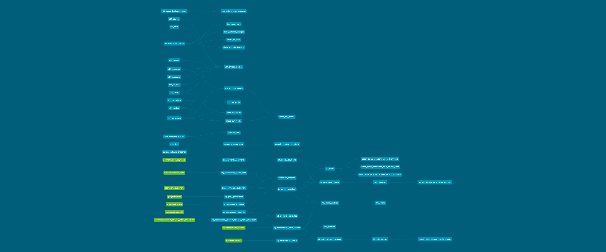

# dbt E-Commerce DWH

Data modeling project implementing a DWH with dbt Core and BigQuery on the [Olist Brazilian E-Commerce dataset](https://www.kaggle.com/datasets/olistbr/brazilian-ecommerce).

## Stack
- **dbt Core** — transformations, testing, documentation
- **BigQuery** — data warehouse
- **Elementary** — data observability
- **GitHub Actions** — CI/CD

## Project Structure
- **Staging** — raw source cleaning and renaming (views)
- **Intermediate** — business logic joins and deduplication
- **Marts** — final dimensional models (Kimball)
  - `fct_orders` — incremental fact table
  - `fct_order_reviews` — incremental fact table
  - `dim_customers` — SCD Type 2 snapshot
  - `dim_products`, `dim_sellers`

## Lineage Graph

## Data Quality
- Generic tests: `not_null`, `unique`, `relationships`, `accepted_values`
- Custom tests via `dbt_utils`
- Singular tests for business rules
- Observability via Elementary

## Documentation
[dbt docs →](https://liliyarmkhmtv.github.io/dbt-ecommerce-dwh/#!/overview)